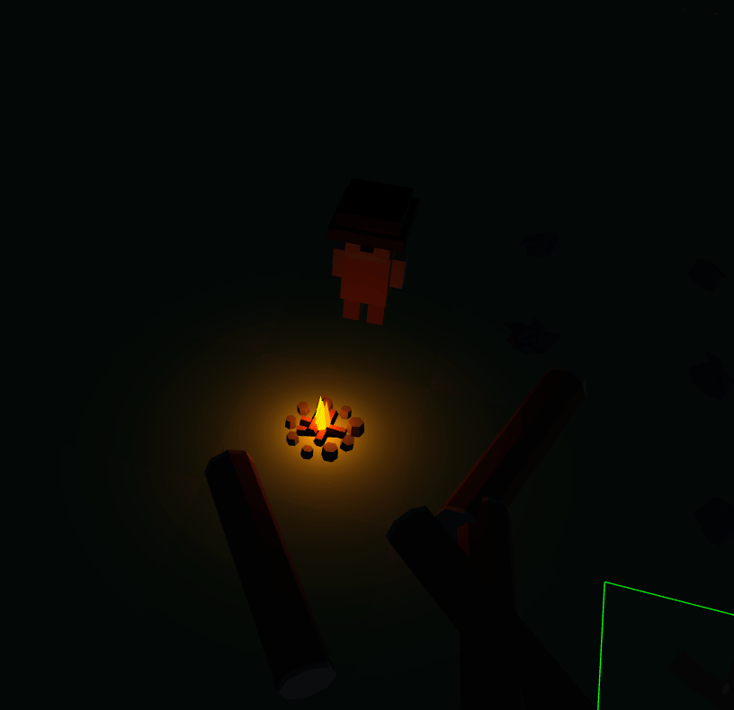
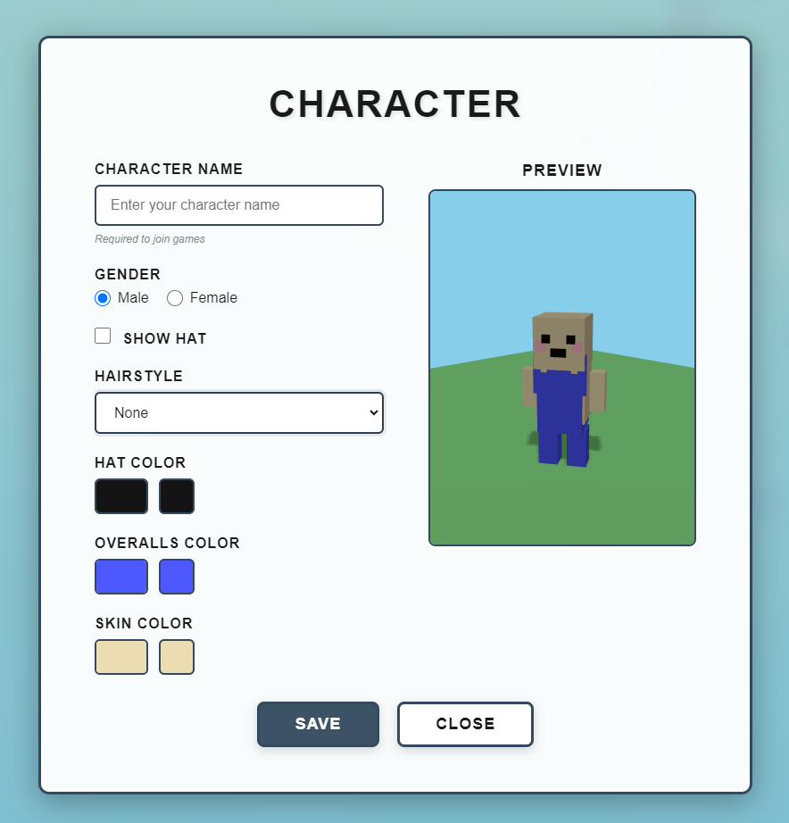

# Taskforge: Automation

An Autonauts-style visual programming automation game built with **Three.js** and Electron.






## Setup

1. Install dependencies:
```bash
npm run install-all
```

2. Build the client (required before first run):
```bash
cd client
npm run build:dev
cd ..
```

3. Start the game:
```bash
npm start
```

Or from the client directory:
```bash
cd client
npm start
```

4. Build for production:
```bash
cd client
npm run build
```

## Development

### Desktop Development (Electron)

For development with hot reload:
```bash
cd client
npm run dev
```

Then in another terminal, start Electron:
```bash
cd client
npm run electron
```

### Web Development

Run the web version in your browser:
```bash
cd client
npm run web
```

### Server Development

Start the multiplayer server separately:
```bash
npm run server
```

Or run both client and server together:
```bash
npm run dev
```

## Project Structure

- `client/` - Electron + Three.js game client
- `server/` - WebSocket server for multiplayer
- `docs/` - Documentation and requirements

## Technology Stack

- **Three.js** (v0.160.0) - 3D rendering engine
- **Electron** - Desktop application framework
- **Node.js** + **WebSocket** - Multiplayer server
- **Webpack** - Module bundling
- **Babel** - JavaScript transpilation

